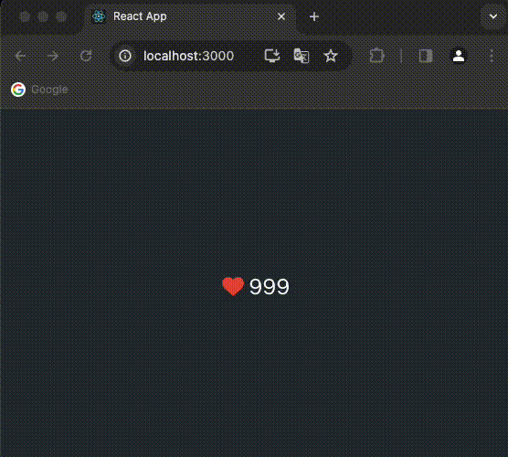

# React My Like Component

React による自作いいねコンポーネント



## 環境情報

- Node.js >= 19.9
- yarn >= 1.22

## 動作確認方法

1. リポジトリのクローン
   ```
   $ git clone https://github.com/Pu-of-Parari/react-my-like-component.git
   $ cd react-my-like-component
   ```
2. 依存関係のインストール
   ```
   $ yarn install
   ```
3. アプリケーション起動
   ```
   $ yarn start
   ```
   - http://localhost:3000 でアプリが起動する
